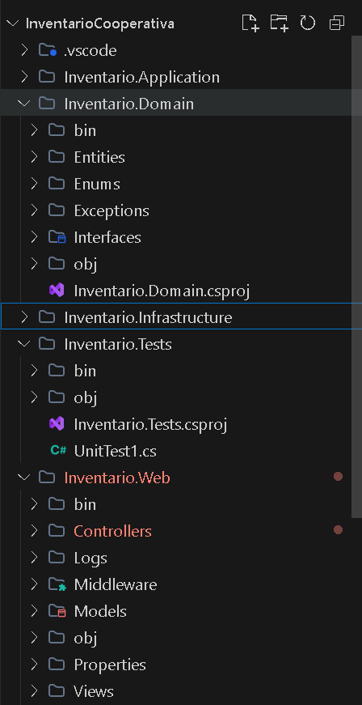
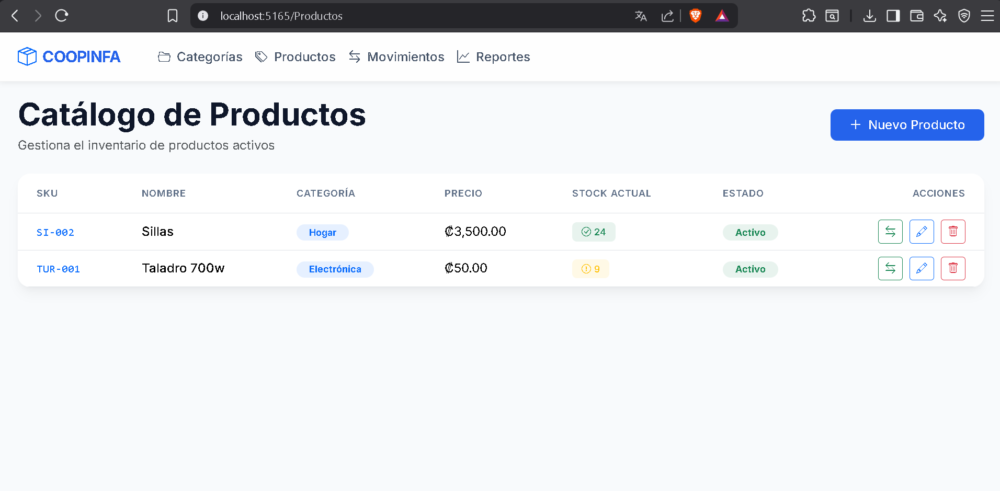
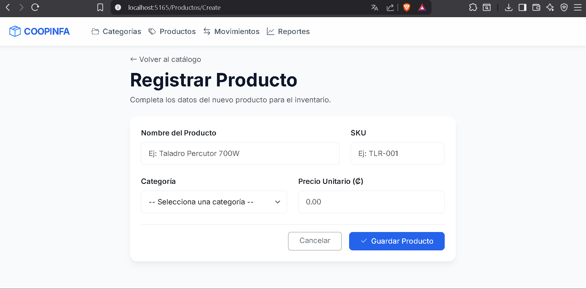
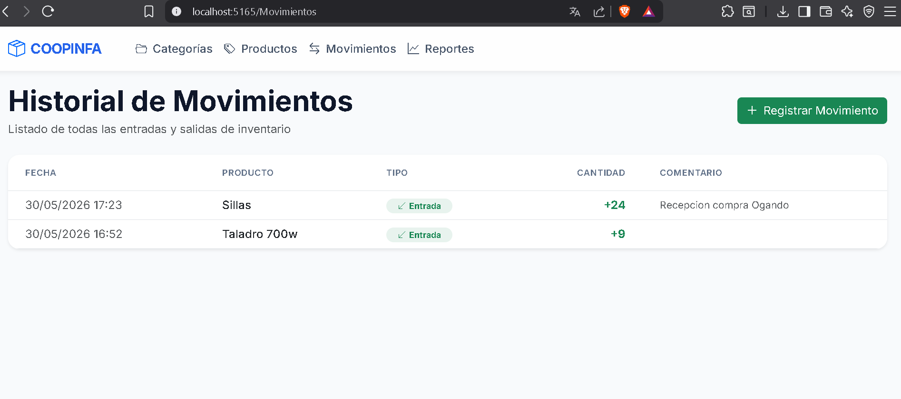
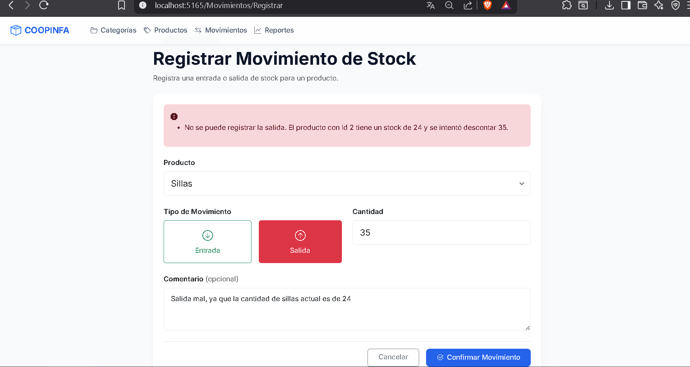
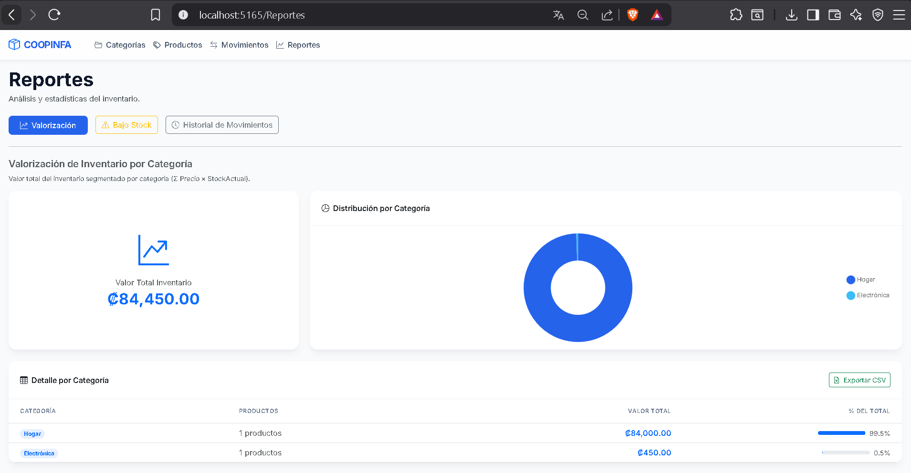
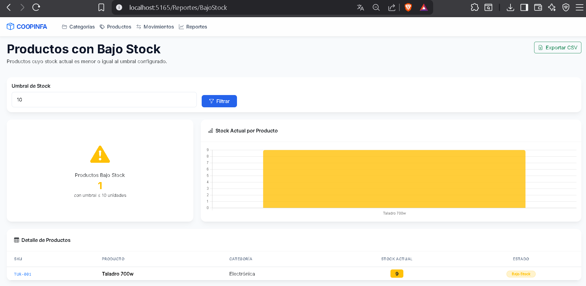
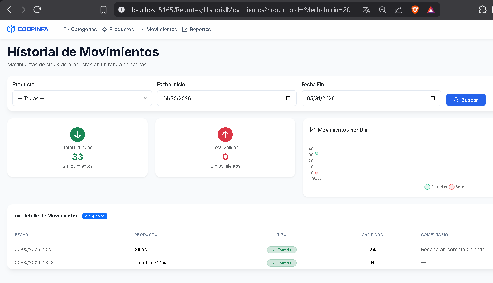
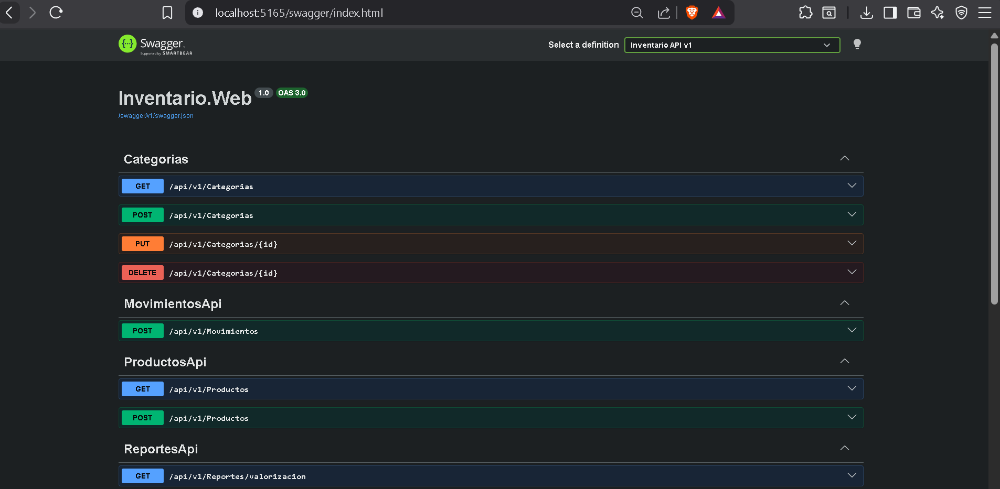

# Prueba Técnica .NET - COOPINFA
**Autor:** Wilbren A. Rosario Serrano
**Posición:** Desarrollador .NET
**Fecha:** 2026-05-30
---

## 1. Arquitectura y Diseño Base (Clean Architecture + CQRS)

**Explicación de la funcionalidad:**
El sistema está construido siguiendo la **Arquitectura Limpia (Clean Architecture)**, dividiendo responsabilidades en cuatro capas: Domain, Application, Infrastructure y Web. Esto asegura que la lógica de negocio esté completamente aislada de las bases de datos y frameworks web. Se implementó **CQRS con MediatR** para separar las consultas (Queries) de los comandos (Commands), manteniendo los controllers completamente delgados: solo reciben la request HTTP y delegan al Mediator.

**Mayor dificultad:**
La mayor dificultad fue asegurar que las validaciones de dominio (como evitar stock negativo) se ejecutaran de manera pura en el Domain, sin depender del contexto de Entity Framework, logrando luego persistir estos cambios transaccionalmente. El uso de `IUnitOfWork` para envolver los Repositories sin exponer EF Core a la capa Application requirió un diseño cuidadoso de interfaces.

---

## 2. CRUD de Categorías y Productos (con Soft Delete)

**Explicación de la funcionalidad:**
Se implementó el CRUD completo tanto para **Categorías** como para **Productos** en las vistas MVC y en la API REST (`/api/v1/categorias` y `/api/v1/productos`). El CRUD de productos incluye:
- Búsqueda por nombre/SKU.
- Filtro por categoría y estado (activo/inactivo).
- Paginación del listado.
- **Soft Delete**: eliminar un producto no lo borra físicamente de la base de datos; solo marca el campo `Activo = false`. Se usa un **Global Query Filter** de EF Core (`HasQueryFilter`) para excluir automáticamente los productos inactivos en todas las consultas.

**Mayor dificultad:**
El Global Query Filter de EF Core es muy conveniente, pero requirió cuidado al diseñar el handler de `EliminarProducto`: al hacer `GetById` antes de desactivar, el mismo Query Filter ocultaría el producto si ya estuviera inactivo, por lo que se necesitó deshabilitar el filtro globalmente usando `IgnoreQueryFilters()` en ese contexto específico.

---

## 3. Registro de Movimientos de Stock (Transacciones y Concurrencia)

**Explicación de la funcionalidad:**
El registro de movimientos de stock (entradas y salidas) actualiza la cantidad del producto dentro del mismo contexto transaccional (ACID). Para evitar el problema clásico de la "doble actualización" concurrente, se incluyó un **token de concurrencia optimista** (`RowVersion`) en la entidad `Producto` mediante EF Core. Esto garantiza que si dos usuarios actualizan el stock del mismo producto simultáneamente, solo uno tendrá éxito y el otro recibirá un error controlado (`DbUpdateConcurrencyException`) que el middleware global convierte a una respuesta HTTP 409 Conflict en formato ProblemDetails.

**Mayor dificultad:**
Orquestar la creación de un `MovimientoStock` y la actualización del `StockActual` del `Producto` dentro del mismo handler CQRS, implementando el patrón `IUnitOfWork` para asegurar que ambas operaciones ocurran juntas o se haga rollback completo, sin acoplar MediatR a EF Core en la capa de Aplicación.

---

## 4. Reportería de Inventario

**Explicación de la funcionalidad:**
Se desarrollaron tres reportes de negocio accesibles desde el menú "Reportes":

### 4.1 Valorización por Categoría
Calcula el valor total del inventario agrupado por categoría (StockActual × Precio) en tiempo real, omitiendo productos inactivos. Incluye tabla detallada + **gráfico de dona** interactivo + exportación a **CSV**.

### 4.2 Productos con Bajo Stock
Permite configurar un umbral (por defecto 10 unidades) y lista todos los productos activos cuyo stock es igual o menor. Incluye **gráfico de barras** con colores por nivel de alerta + exportación a **CSV**.

### 4.3 Historial de Movimientos
Filtrable por producto y rango de fechas. Muestra totales de entradas y salidas, y un **gráfico de línea** de evolución temporal. Disponible también vía API: `GET /api/v1/Reportes/historial-movimientos`.

**Mayor dificultad:**
Optimizar las consultas con LINQ (`GroupBy`) para asegurar que el cálculo matemático se ejecute directamente en SQL Server (Server-side evaluation) y no en memoria (evitando N+1 queries y Client-side evaluation). Los reportes con navegación por propiedades (`p.Categoria.Nombre`) requirieron verificar el generado de SQL con `ToQueryString()` durante el desarrollo.

---

## 5. API REST Versionada con Swagger

**Explicación de la funcionalidad:**
Se construyó una API expuesta en `/api/v1/`, completamente documentada con **Swagger / OpenAPI**. Las entidades de EF Core nunca se exponen al exterior; en su lugar, se utilizan DTOs mapeados con AutoMapper y proyecciones manuales. Los endpoints implementados incluyen:

- `GET/POST/PUT/DELETE /api/v1/productos`
- `POST /api/v1/movimientos`
- `GET/POST/PUT/DELETE /api/v1/categorias`
- `GET /api/v1/Reportes/valorizacion`
- `GET /api/v1/Reportes/bajo-stock?umbral={n}`
- `GET /api/v1/Reportes/historial-movimientos?productoId={id}&fechaInicio={}&fechaFin={}`

La API soporta formato **ProblemDetails (RFC 7807)** para errores consistentes, con códigos HTTP correctos (200, 201, 204, 400, 404, 409, 422, 500).

**Mayor dificultad:**
Configurar correctamente el **Middleware Global de Manejo de Excepciones** para capturar las excepciones de dominio (`DomainException`, `NegativeStockException`, `DbUpdateConcurrencyException`) y traducirlas automáticamente a códigos HTTP correctos manteniendo el formato ProblemDetails en todos los casos.

