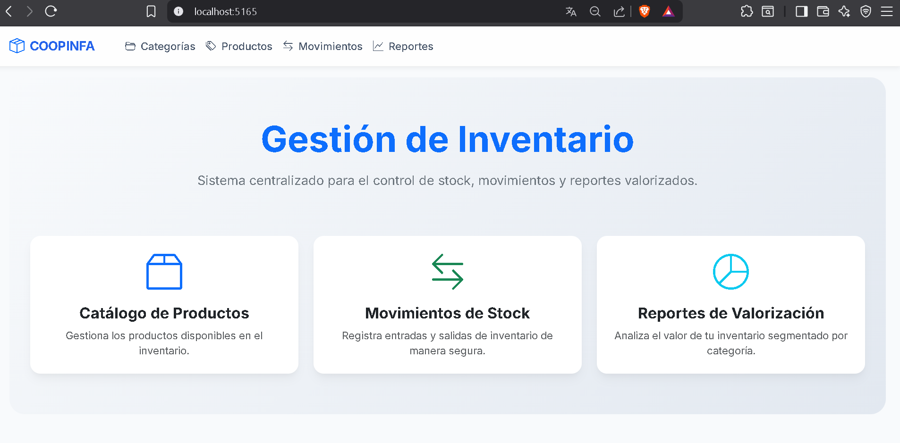

# Sistema de Gestión de Inventario - COOPINFA

Este repositorio contiene la solución a la **Prueba Técnica .NET** para la gestión de inventario, desarrollada con **ASP.NET Core MVC (.NET 8)**, **Entity Framework Core**, **SQL Server** y **Clean Architecture**.

## Arquitectura y Decisiones de Diseño

La solución se divide en las siguientes capas siguiendo **Clean Architecture**:

| Capa | Proyecto | Responsabilidad |
|---|---|---|
| Domain | `Inventario.Domain` | Entidades, enumeraciones, excepciones de dominio e interfaces de repositorios |
| Application | `Inventario.Application` | Casos de uso con CQRS/MediatR, DTOs, Queries y Commands |
| Infrastructure | `Inventario.Infrastructure` | EF Core, repositorios, Unit of Work, migraciones y seed |
| Web | `Inventario.Web` | MVC + API REST `/api/v1/`, Swagger, Serilog, Middleware de excepciones |

### Patrón CQRS con MediatR
Se eligió **CQRS con MediatR** (en lugar de servicios tradicionales) para:
- Separar completamente las operaciones de lectura (Queries) de las de escritura (Commands).
- Mantener controllers delgados — solo reciben la petición y delegan al Mediator.
- Facilitar agregar validaciones, logging y behaviors de forma transversal sin modificar lógica de negocio.

### Manejo de Transacciones y Concurrencia
- **Transacciones ACID**: El registro de movimientos de stock envuelve en una transacción explícita (`IUnitOfWork.BeginTransactionAsync`) tanto la creación del `MovimientoStock` como la actualización del `StockActual` del `Producto`.
- **Concurrencia Optimista**: La entidad `Producto` tiene un campo `RowVersion` (token de concurrencia de EF Core). Si dos operaciones simultáneas intentan modificar el mismo producto, la segunda recibirá un `DbUpdateConcurrencyException`, que es capturada por el middleware global.

## Instrucciones de Ejecución

### Opción 1: Docker (Recomendada)
```bash
# En la raíz del proyecto
docker-compose up -d --build
```
- Aplicación: `http://localhost:8080`
- Swagger: `http://localhost:8080/swagger`
- Las migraciones y seed se aplican automáticamente al iniciar.

### Opción 2: Local con SQL Server
1. Asegúrate de tener **SQL Server** (o LocalDB) instalado y en ejecución.
2. Configura la cadena de conexión en `Inventario.Web/appsettings.json`.
3. Aplica las migraciones:
   ```bash
   dotnet ef database update --project Inventario.Infrastructure --startup-project Inventario.Web
   ```
4. Ejecuta la aplicación:
   ```bash
   dotnet run --project Inventario.Web
   ```
5. Navega a `https://localhost:7193` (o el puerto asignado).

## Pruebas Automatizadas

El proyecto `Inventario.Tests` utiliza **xUnit**, **Moq** y **FluentAssertions**, cubriendo:
- Reglas de negocio del Dominio: evitar stock negativo (`NegativeStockException`).
- Handler de `RegistrarMovimientoCommandHandler`.

```bash
dotnet test
```

## Funcionalidades Implementadas

### Vistas MVC
- **Categorías**: CRUD completo (Crear, Editar, Eliminar, Listar).
- **Productos**: CRUD completo con soft delete, búsqueda, filtro por categoría/estado y paginación.
- **Movimientos**: Registro de entradas y salidas de stock con actualización transaccional.
- **Reportes**:
  - Valorización por categoría (tabla + gráfico de dona) + exportación CSV.
  - Productos con bajo stock (umbral configurable) + gráfico de barras + exportación CSV.
  - Historial de movimientos con filtros por producto y rango de fechas + gráfico de línea.

### API REST (`/api/v1/`)
- `GET/POST/PUT/DELETE /api/v1/productos` — CRUD de productos con DTOs y validación.
- `POST /api/v1/movimientos` — Registrar movimiento de stock.
- `GET /api/v1/categorias` — CRUD de categorías.
- `GET /api/v1/Reportes/valorizacion` — Valorización por categoría.
- `GET /api/v1/Reportes/bajo-stock?umbral=10` — Productos con bajo stock.
- `GET /api/v1/Reportes/historial-movimientos` — Historial filtrado por producto y fechas.

Todos los errores siguen el estándar **RFC 7807 (ProblemDetails)**.

## Oportunidades de Mejora (Con más tiempo)
- **Autenticación/Autorización**: JWT en la API y Cookie Auth con ASP.NET Core Identity.
- **Caché Distribuido**: Redis para reportes de valorización frecuentemente consultados.
- **CI/CD**: Pipeline de GitHub Actions para tests automáticos y publicación de imagen Docker.


## Vista General
